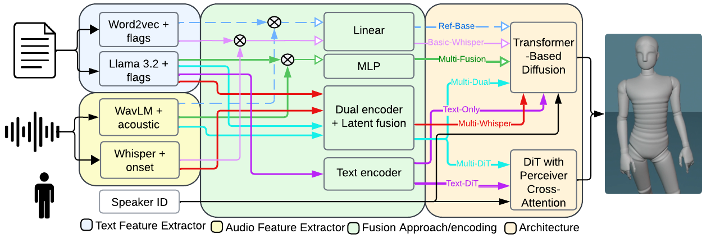

# From Embeddings to Language Models: A Comparative Analysis of Feature Extractors for Text-Only and Multimodal Gesture Generation

### ⚠️ Important Notice

📅 **The full implementation of the repository and pipeline configurations will be available after September 17th.**

**Johsac I. G. Sanchez, Paula D. P. Costa**
*ACM International Conference on Multimedia (ACM Multimedia) 2025*

📄 **[Paper PDF](docs/paper.pdf)** | 🌐 **[Project Page/Videos]** 

---


*Figure 1: Flowchart of the evaluated experimental pipelines, from our paper.*

## 📝 Abstract

Generating expressive and contextually appropriate co-speech gestures is crucial for naturalness in human-agent interaction. This study presents a systematic evaluation of seven gesture generation pipelines, comparing audio (WavLM, Whisper) and text (Word2Vec, Llama-3.2) feature extractors. We demonstrate that a smaller 3B-parameter LLM can achieve state-of-the-art performance, offering guidance for balancing generative quality with model accessibility.

## 🚀 Key Features

- 🛠️ Implementation of 7 distinct gesture generation pipelines (multimodal and text-driven).
- 📦 Pre-trained models for all evaluated pipelines, including \`Text-Only\`, \`Text-DiT\`, \`Multi-Dual\`, and more.
- 🎥 Code to run inference and generate gestures from your own audio/text files.
- 📊 Scripts for objective evaluation using metrics like FGD, BAS, DS, APSD, JM, and Dice.
- 📹 Supplementary videos showing qualitative results for all pipelines.

## 📂 Project Structure

📂 LLM-Gesture-Pipelines  
┣ 📜 README.md  
┣ 📜 environment.yml  
┣ 📜 Dockerfile  
┣ 📜 .gitignore  
┣ 📂 DiffuseStyleGesture  
┃ ┣ *(Content from the [DiffuseStyleGesture](https://github.com/YoungSeng/DiffuseStyleGesture.git) repository)*  
┣ 📂 data  
┃ ┣ 📜 README.md  
┃ ┣ 📂 train  
┃ ┃ ┣ 📄 sample_train.tsv  
┃ ┣ 📂 test  
┃ ┃ ┣ 📄 sample_test.tsv  
┣ 📂 models  
┃ ┣ 📂 llm  
┃ ┃ ┣ 📄 llama3b_config.py  
┃ ┣ 📄 mdm.py  
┃ ┣ 📄 mdm_1red_audtex.py  
┃ ┣ 📄 mdm_1red_text.py  
┃ ┣ 📄 mdm_2red_aud_tex.py  
┃ ┣ 📄 mdm_llama3b.py  
┃ ┣ 📄 mdm_dit_audtex.py  
┃ ┣ 📄 mdm_dit_tex.py  
┃ ┣ 📄 mdm_whisper_word2vec.py  
┃ ┣ 📄 mdm_whisper_llama3b.py  
┃ ┣ 📂 pretrained  
┃ ┃ ┣ 📜 README.md  
┣ 📂 scripts  
┃ ┣ 📄 process_embedding_training.py  
┃ ┣ 📄 train.py  
┃ ┣ 📄 inference.py  
┃ ┣ 📄 evaluate.py  
┣ 📂 evaluation  
┃ ┣ 📜 environment.yml  
┃ ┣ 📜 Dockerfile  
┃ ┣ 📂 metrics  
┃ ┃ ┣ 📄 Metrics-results-generated_540k-llm.txt  
┃ ┣ 📂 videos  
┃ ┃ ┣ 📜 README.md  
┣ 📂 examples  
┃ ┣ 📄 generate_gestures.py  
┃ ┣ 📄 sample_output.bvh  
┃ ┣ 📂 sample_input  
┃ ┃ ┣ 📄 sample.wav  
┃ ┃ ┣ 📄 sample.txt  
┣ 📂 docs  
┃ ┣ 📄 paper.pdf  
┃ ┣ 📄 setup_guide.md  
┃ ┣ 📄 pipelines.png

## ⚙️ Setup & Installation

1. **Clone the repository**:
    ```bash
    git clone https://github.com/AI-Unicamp/LLM-Gesture-Pipelines.git
    cd LLM-Gesture-Pipelines
    ```

2. **Build the Docker image for training/inference**:
    ```bash
    docker build -t llm .
    ```

3. **Build the Docker image for evaluation**:
    ```bash
    cd evaluation
    docker build -t benchmarking_sdgg_models_image .
    cd ..
    ```

4. **Run the container for training/inference**:
    ```bash
    docker run --rm -it --gpus device=0 --userns=host --shm-size 64G -v /work/johsac.sanchez:/workspace/textdrive/ -p '8888:8888' --name my_container llm-gesture-pipeline:latest /bin/bash
    ```

5. **Run the container for evaluation** (if using separately):
    ```bash
    docker run --rm -it --gpus device=0 --name my_evaluation_container llm-gesture-evaluation:latest /bin/bash
    ```

6. **Install dependencies** (if not using Docker):
    ```bash
    conda env create -f environment.yml
    conda activate textgesture
    pip install pydub praat-parselmouth essentia TextGrid bvhsdk wandb
    conda install -c conda-forge ffmpeg h5py
    ```

## 🛠️ Usage

### Preprocessing
Process audio (WavLM/Whisper) and text (Llama3.2/Word2Vec) embeddings:
```bash
conda run -n textgesture python scripts/process_embedding_training_v2_gg.py \
    --wavlm_path path/to/WavLM-Large.pt \
    --llm_model_path path/to/llama-3.2-3b-instruct \
    --wav_path data/wav/ \
    --txt_path data/tsv/ \
    --train_npy_path output/npy/
```

### Training
Train a model (e.g., model v6: DiT + WavLM + Llama3B):
```bash
conda run -n textgesture python scripts/train.py --model models/mdm_dit_audtex.py
```

### Inference
Generate gestures from audio and text inputs:
```bash
conda run -n textgesture python scripts/inference.py \
    --model models/mdm_dit_audtex.py \
    --audio examples/sample.wav \
    --text "Sample text" \
    --output examples/sample_output.bvh
```

### Evaluation
Compute objective metrics (FGD, BAS, DS, APSD, JM, Dice):
```bash
conda run -n textgesture python scripts/evaluate.py
```
Results available in `evaluation/metrics/Metrics-results-generated_540k-llm.txt`.

*Note*: If evaluation scripts are not compatible with PyTorch 2.1.0, use the `llm-gesture-evaluation` container.

## 📊 Metrics

Implemented metrics:
- **FGD**: Fréchet Gesture Distance
- **BAS**: Beat Alignment Score
- **DS**: Diversity Score
- **JM**: Jerk Magnitude
- **Dice**: Dice Coefficient

Detailed results in `evaluation/metrics/`.

## 📹 Videos

Evaluation videos available in `evaluation/videos/`. Follow instructions in `evaluation/videos/README.md` to download them.

## 📄 Citation

If you use this code or our models, please cite:
```bibtex
@inproceedings{sanchez2025embeddings,
  title={From Embeddings to Language Models: A Comparative Analysis of Feature Extractors for Text-Only and Multimodal Gesture Generation},
  author={Sanchez, Johsac Isbac Gomez and Costa, Paula Dornhofer Paro},
  booktitle={GENEA: Generation and Evaluation of Non-verbal Behaviour for Embodied Agents Workshop 2025},
  year={2025}
}
```

## 📚 Acknowledgments

- Based on [DiffuseStyleGesture](https://github.com/YoungSeng/DiffuseStyleGesture.git).
- Thanks to the libraries: PyTorch, Transformers, Librosa, and others.

## 📧 Contact

For questions or contributions, contact [paulad@unicamp.br](mailto:paulad@unicamp.br).
